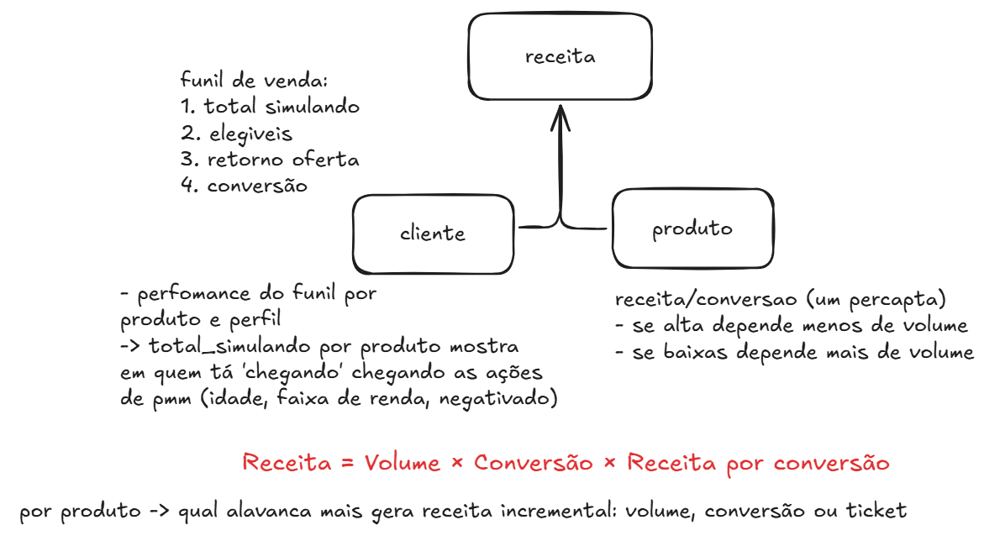
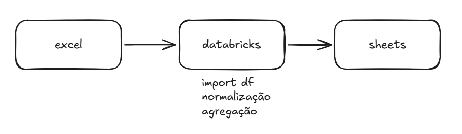

# Análise de Receita — Crédito

## Objetivo

Entender, por produto, qual alavanca mais impacta a receita:

* volume (simulações)
* conversão
* receita por conversão



---

## Modelo

```
receita = volume × conversão × receita_por_conversão
```

---

## Estrutura

A análise é feita sobre:

```
perfil_cliente × produto
```

---

## Fluxo



* databricks: preparação dos dados (etl.ipynb)
* google sheets: exploração e análise

---


## Observação

Os dados não representam um funil linear (elegíveis pode ser maior que simulando).

---

## Referências

* exploratory_data.ipynb
* planilha: https://docs.google.com/spreadsheets/d/1brGaTDOvhRGt9DIhHJLizVU40zYnfC6iLgBwJ-QLGxg/edit?usp=sharing
* apresentação: https://docs.google.com/presentation/d/10ravmZybtYgnizuRnLi4tayPelf5cSH-9kEK7y9i9N4/edit?slide=id.g3d35682f9f5_0_113#slide=id.g3d35682f9f5_0_113
